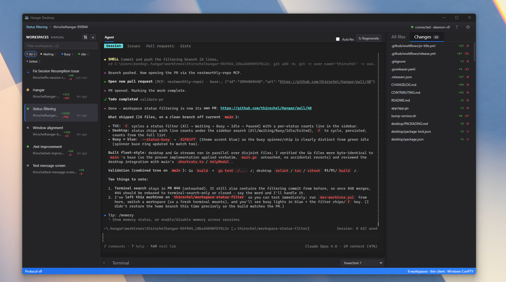
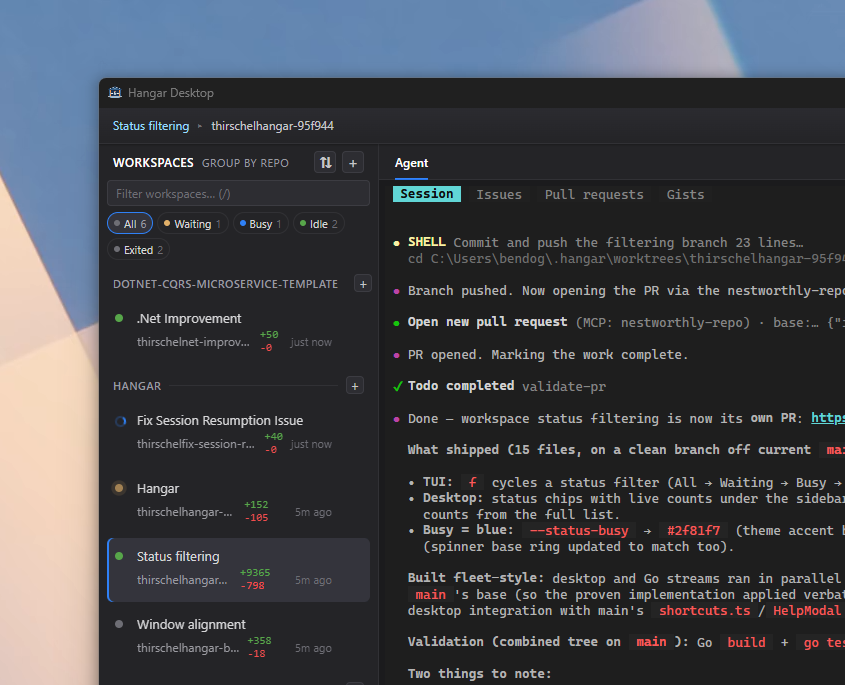
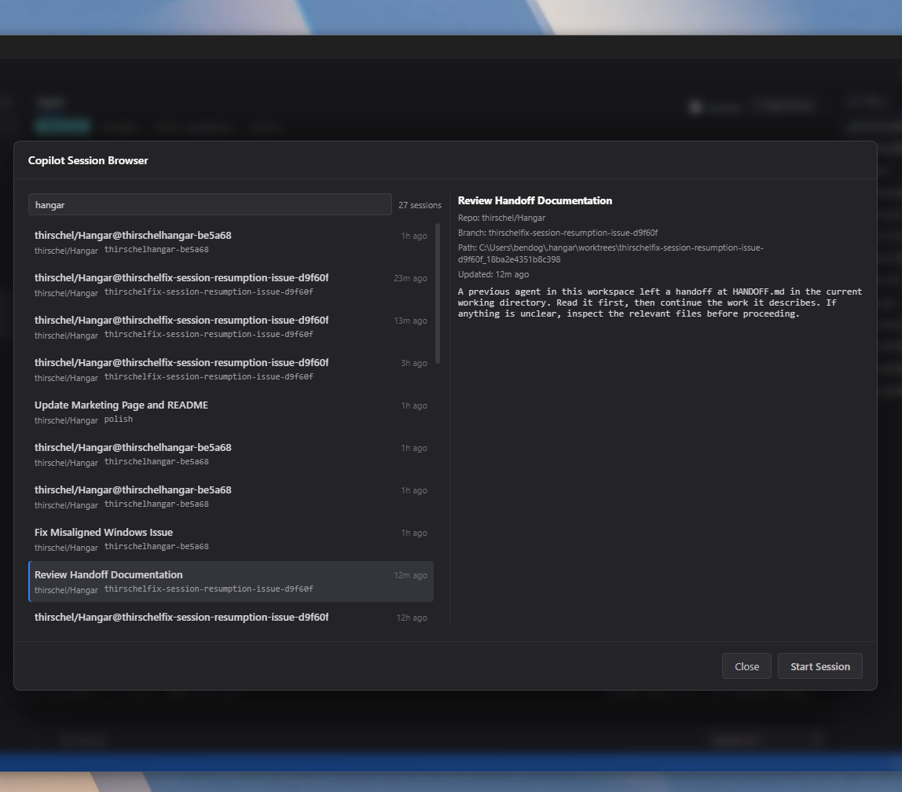
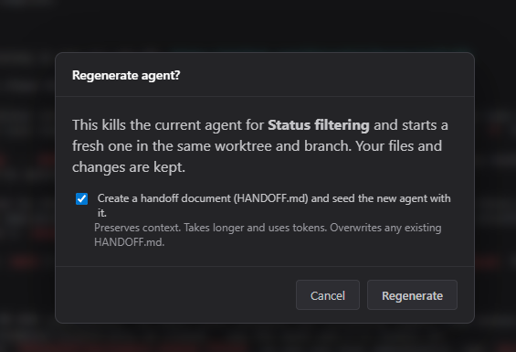

<p align="center"></p>

# Hangar

<p align="center"><strong>A hangar for all your copilots.</strong></p>
<p align="center">A lightweight harness around your favorite CLI coding agent — on native Windows.</p>

<p align="center">
  <a href="https://github.com/thirschel/Hangar/actions/workflows/build.yml"></a>
</p>

<p align="center">
  <a href="https://thirschel.github.io/Hangar/">Website</a> ·
  <a href="https://github.com/thirschel/Hangar">Repository</a>
</p>

[Hangar](https://thirschel.github.io/Hangar/) is a lightweight harness around your favorite CLI coding agent — run several in parallel, each in its own isolated git worktree, and review their work before it ships. Native Windows. No WSL, no tmux. The Windows desktop app is the primary way to install Hangar; under the hood, each agent runs in a real Windows console (ConPTY) that inherits your PATH, tools, internal/company tooling, and existing authentication. Hangar is powered by the `cs` core-daemon/session host, so agents keep working even when the desktop app or TUI is closed.



## Why Hangar

### Runs natively on Windows

No WSL, no tmux. The Hangar desktop app drives a background `cs session-host` that owns a real Windows console (ConPTY) per agent, talks over a named pipe, and renders terminal output via a VT emulator. Because that console is real and not a sandbox, each agent inherits the same environment as the terminal you already work in: the apps and tools on your PATH, your internal/company tooling, and, most importantly, your existing authentication. If your CLI agent already works in your terminal, it works the same in Hangar, with the access it needs to actually get things done on your machine. Sessions survive app and TUI restarts.

### Supervise multiple agents at once

Claude Code, Codex, Gemini, GitHub Copilot CLI, and Aider side by side from one native Windows app, with the `cs` engine available as a terminal dashboard too.

### Isolated git worktrees

Every session on its own branch/worktree; tasks never collide.

### In-place sessions (no worktree)

Prefer to work directly in a folder? Uncheck **Create an isolated git worktree** in the New
workspace dialog to open the agent straight in the selected folder — no worktree, no new branch.
It edits your real files on your current branch, and Diff/Commit/Push operate on that folder when
it's a git repo (any non-git folder still opens, just without those git features). Worktree-backed
sessions are marked with a ⎇ icon in the sidebar so the two kinds are easy to tell apart.

### Review before you ship

Inspect each session's diff, then commit & push or checkout & pause.

### Background + AutoYes

Agents keep working and auto-accept prompts even while the desktop app or TUI is closed; pauses while you're attached.

## A closer look

**Status filtering & grouping** — filter workspaces by Waiting / Busy / Idle / Exited and group them by repo, with live per-status counts.



**Copilot Session Browser** — search and resume your local GitHub Copilot CLI sessions in a fresh isolated worktree.



**Rich agent view (experimental, Windows)** — for GitHub Copilot CLI sessions, optionally render a structured chat transcript (streaming assistant text, reasoning, tool cards, MCP server status, and inline permission & `ask_user` prompts) driven by the official Copilot SDK instead of the raw terminal. Opt in per workspace from the **New workspace** dialog, or globally via `copilot_rich_view` in `config.json`; the terminal backend stays the default for every agent. See [`docs/rich-agent-view.md`](docs/rich-agent-view.md).

**Regenerate with handoff** — restart an agent in place, optionally writing a HANDOFF.md so the fresh agent keeps its context.



**Multi-agent grid** — view several agents at once as a grid of live, focusable tiles and type straight into any of them; agents-per-row defaults to Auto (by width) with no fixed cap. In the **TUI**: mark 2+ sessions (`m`), press `g`, and type into the focused tile (`Ctrl+Q` releases, `Esc` leaves). In the **desktop app**: tick 2+ agents in the sidebar, click **▦ Grid**, then click a tile and type, and drag tiles by their header to rearrange.

## Installation

### Download (Windows desktop app)

Download `Hangar-Setup-<version>.exe` from [the latest Hangar release](https://github.com/thirschel/Hangar/releases/latest), then double-click it to install the Windows desktop app. Hangar uses an NSIS installer and auto-updates with `electron-updater`. Releases publish the Windows `.exe` installer as assets, replacing the old GoReleaser Go-binary release.

> **Current status:** no release is published yet — until then, build from source (below).

> **Unsigned installer:** Hangar is currently unsigned. Windows SmartScreen may warn on first run; choose **More info** → **Run anyway** if you trust this repository.

### Build from source

#### Daemon/CLI (`cs`)

Build the underlying `cs` daemon/CLI from this fork when you want the standalone TUI or while the desktop installer is not yet published:

```bat
:: Requires Go 1.25+ (https://go.dev/dl/), git, and an agent installed on Windows
:: Your agent must be resolvable, for example: where copilot
git clone https://github.com/thirschel/Hangar.git
cd Hangar
build.bat
```

`build.bat` produces `cs.exe` in the repo root. You can also build the same binary with:

```bat
go build -o dist\cs.exe .
```

Put `cs.exe` on your `PATH`, then run `cs` from within a git repository.

Your agent (for example GitHub Copilot CLI) must be installed on Windows and resolvable:

```bat
where copilot
```

For how the native-Windows build behaves (session-host persistence, AutoYes, pause/resume, and tmux differences), see [`docs/daemon.md`](docs/daemon.md).

> **Architecture & handoff:** see [`docs/native-windows.md`](docs/native-windows.md) for the full
> design (session host, ConPTY + VT emulator, host-side AutoYes), the alternatives
> considered, and notes for anyone extending the Windows backend.

#### Desktop app

Build the Windows desktop app from source after building the daemon binary:

```bat
git clone https://github.com/thirschel/Hangar.git
cd Hangar
go build -o dist\cs.exe .
cd desktop
npm install
npm run dist
```

The packaged installer is written to `desktop\release\Hangar-Setup-<version>.exe`. See [`desktop/PACKAGING.md`](desktop/PACKAGING.md) for packaging details.

## The daemon under the hood

Hangar is a thin Electron client over the Go `cs session-host` engine, which owns worktrees, ConPTY consoles, VT terminal state, diffs, persistence, and host-side AutoYes. The same `cs` engine can also run standalone as a terminal TUI.

The Go module is `hangar`, the binary is `cs`, and state lives under `~/.hangar/` (`config.json`, `state.json`, `host.json`, `daemon.pid`). See [`docs/daemon.md`](docs/daemon.md) for the full daemon and CLI reference, and [`docs/native-windows.md`](docs/native-windows.md) for the native-Windows architecture deep-dive.

## Prerequisites

The Windows desktop installer needs no source-build toolchain. To use agents, install at least one local AI coding agent such as GitHub Copilot CLI, Claude Code, Codex, Gemini, or Aider.

Building from source requires:

- [Go 1.25+](https://go.dev/dl/) for the `cs` daemon/CLI and native Windows session host
- [Node.js 18+](https://nodejs.org/) and npm for the desktop app build
- [git](https://git-scm.com/) for worktree and branch management
- [gh](https://cli.github.com/) for GitHub operations
- An agent installed on Windows and resolvable from `PATH` (for example, `where copilot`)
- [tmux](https://github.com/tmux/tmux/wiki/Installing) on Unix/macOS/WSL only — not needed for the native Windows build

> **Note (WSL / Linux):** the AI agent you run (e.g. `claude`, `copilot`, `aider`) must be a
> **native Linux executable** that meets its own system requirements. GitHub Copilot CLI, for
> example, requires **glibc 2.28+** (Ubuntu 20.04+, Debian 10+, Fedora 29+) and **Node.js 22+**.
> See [Troubleshooting](docs/daemon.md#troubleshooting).

## License

[AGPL-3.0](https://github.com/thirschel/Hangar/blob/main/LICENSE.md)

Hangar is a fork of [claude-squad](https://github.com/smtg-ai/claude-squad), licensed under AGPL-3.0.

## Star History

[](https://www.star-history.com/#thirschel/Hangar&Date)
